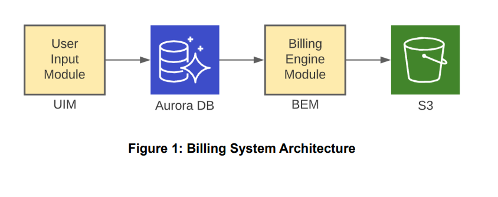
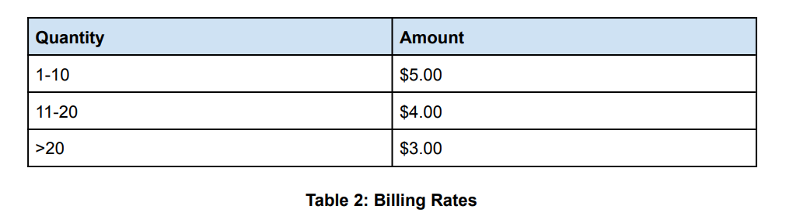
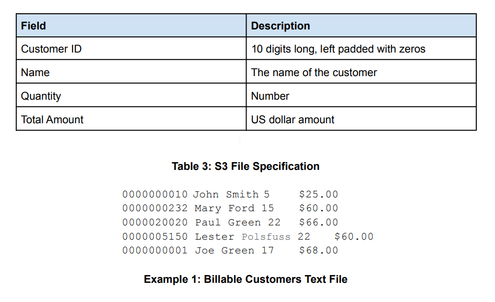

# SIUA-FINAL-PROJECT 
> The Python portion of the final project for Team DataBees, as a graduation requirement for the Step-IT-Up America Program. 


# Billing System

Company ABC is building a billing system. The architecture for the billing system is represented
in Figure 1. The billing system contains two Python components and two storage components
offered by AWS. Details for each of these items are described below.



## User Input Module (UIM)
The UIM is written in Python and accepts user input from the console. The input consists of a
customer id, username, and quantity. For example:

> Add customer: 123, John Smith, 5

The customer id does not contain leading zeros. The customer name only contains a first and
last name. The quantity is a positive integer greater than zero, less than 1,000.

The UIM stores the customer id, username, and quantity in a database table. The program runs
indefinitely until control+c is entered on the console.

## Aurora DB 
The database stores all the data entered from the UIM in this
schema (TeamB{Customer}). The database is secured using an AWS security group and
is only accessible only to SIUA students.

## Billing Engine Module (BEM)
The BEM is written in Python and calculates the amount to bill a customer. When the dollar
amounts for all the customers have been calculated, the BEM saves this information to a text
file located in S3. Customers are aggregated by username preventing duplicate usernames in
the final output file. The BEM runs every 60 seconds until control+c is entered on the
console.

The billing rates for the billing engine are represented in Table 2. If a customer has a total of 5
items their billable amount is: 5 * 5 = $25.00. If a customer has a total of 15 items their billable
amount is: 15 * 4 = $60.00. If a customer has 22 items, their billable amount is:
22 * 3 = $66.00.



The results of the BEM are stored in a file named: billable_customers.txt The BEM
overwrites any existing files in the bucket. The specification for the text file is in Table 3. Fields
in the file are separated by a tab character. Example 1 illustrates the file produced when 5
customers have been entered in the UIM and the BEM has run once.



## S3
Amazon’s Simple Storage Solution stores text files for all the customers to be billed in a bucket
named siua-billable-customers. Text files are stored in this bucket with the following
key path schema:

> TeamBees/billable_customers.txt

## Stretch Goals 
- [X] Use Forever to run the BEM as a Forever process on your computer.
- [X] Store the customer IDs in the text file in ascending order.
- [X] Document your solution in the readme.md file in your group directory.
- [X] Implement the following validation rules for the UIM. If one or more validation rules fail
an appropriate error message is displayed on the console:
  * Customer id must be a valid number
  * Name must only contain letters
  * Quantity must be a valids number
  * All three fields must be requireds
## Installation

OS X & Linux:

```sh
pip install pymysql
pip install boto3
npm install pm2 -g
```

Windows:

```sh
pip install pymysql
pip install boto3
npm install pm2 -g
```
## Development setup
<br>
<p>Operating system, text editor, and Python release version used for development of this project are listed below -- as well as any program dependencies.</p>
<br>

```
Windows 10 Operating System 
Visual Studio Code 
Python 3.10.0
```

```
import pymysql
import boto3
from botocore.exceptions 
import ClientError
from time
import sleep
from datetime 
import datetime
```

# To run the process manager: 
Install 'npm install pm2 -g' in console. After that, switch directories to where file is located. Then type pick your script name and type in 'pm2 start <scriptname.py>'. 